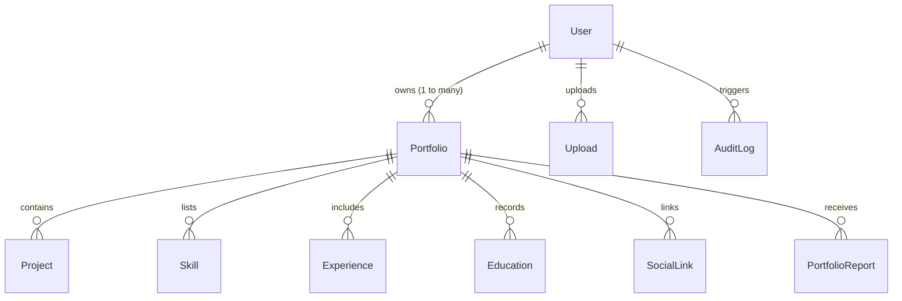

# PortfolioForge — Multi-User Portfolio Platform with Render Health Monitoring

A production-ready, secure, multi-user portfolio creation platform built with **React + Vite**, **Node.js + Express**, and **Prisma ORM (PostgreSQL)**. 

The application enables students, creators, and developers to generate, customize, publish, and share professional web portfolios from their personal profiles, GitHub repositories, skills, and project galleries. It features server-side role-based authorization, 3 responsive templates, Grid/Flexbox layout customizers, and automated **Render Keep-Alive & Health Monitoring**.

---

## 📋 Course Outcomes (CO) Syllabus Compliance

| Course Outcome | Covered Topics & Implementation |
| :--- | :--- |
| **CO-1: Git, Version Control & Semantic HTML5** | - Git lifecycle, branches, structured `.gitignore` exclusions.<br>- Semantic HTML5 layout tags (`<header>`, `<nav>`, `<main>`, `<section>`, `<article>`, `<aside>`, `<footer>`, `<time>`).<br>- Form validation attributes (`required`, `type="email"`, `pattern`, `minlength`).<br>- Accessible ARIA tags, meta viewport, OpenGraph tags, and SEO tags. |
| **CO-2: CSS3 Styling & Core Layouts** | - External modular styling, CSS Custom Properties (`--primary`, `--bg-card`, `--font-sans`).<br>- **CSS Grid Layout**: Responsive multi-column project cards gallery (`repeat(auto-fill, minmax(320px, 1fr))`).<br>- **CSS Flexbox**: Sticky navigation bar, hero banner, button groups, and horizontal/vertical responsive rows.<br>- Interactive **Project Layout Customization** (Toggle between CSS Grid and Flexbox).<br>- Light & Dark mode themes with persistent user state. |
| **CO-2: Core JavaScript & Asynchronous Features** | - Modern ES6+ syntax (`async/await`, destructuring, arrow functions, modules).<br>- Asynchronous REST API integration with GitHub (`https://api.github.com/users/:username/repos`) for 1-click project importing.<br>- Reactive DOM state management in React 18.<br>- Resilient HTTP client with timeout handling and exponential backoff. |

---

## 🔐 Faculty Evaluator Access & Demo Credentials

To make evaluation straightforward for faculty and examiners, default seeded credentials are pre-configured:

### 1. Faculty Evaluator & Administrator
- **Username / Login**: `Suneetha Mam` *(or `suneetha@university.edu`)*
- **Password**: `12345`
- **Role**: `ADMIN`
- **Access**: Full access to the protected **Faculty Admin Portal** (`/admin`), user moderation, portfolio unpublishing, abuse report reviews, and real-time Render keep-alive health diagnostics.
- *Tip*: On the Sign In page, click the **"Autofill Faculty Admin"** button to log in with a single click.

### 2. Student Creator Account
- **Username / Login**: `Abhijeet Arjeet` *(or `abhijeet@example.com`)*
- **Password**: `password123`
- **Role**: `USER`
- **Access**: Pre-populated live portfolio showcasing SIH VAYU-CPI, OpenDisplay-USB, AniScribe, verified skills, and academic history.

---

## 🏗️ Architecture & Technology Stack

```text
portfolio-platform/
├── client/                      # Frontend Application (React + Vite)
│   ├── src/
│   │   ├── components/
│   │   │   ├── common/          # Navbar, Footer, ColdStartBanner, LoadingSpinner
│   │   │   ├── editor/          # PersonalInfo, ProjectsManager (GitHub Sync), Skills, Themes
│   │   │   └── portfolio/       # TemplateMinimal, TemplateDeveloper, TemplateCreative
│   │   ├── context/             # AuthContext, ThemeContext (Light/Dark)
│   │   ├── pages/               # Home, Login, Register, Dashboard, PortfolioEditor, PublicPortfolio, AdminDashboard
│   │   ├── services/            # Resilient API client, Auth, Portfolio, GitHub, Uploads
│   │   └── styles/              # main.css (design system), templates.css (Grid/Flexbox)
│   ├── package.json
│   └── vite.config.js
│
├── server/                      # Backend REST API (Node.js + Express + Prisma)
│   ├── prisma/
│   │   ├── schema.prisma        # Relational database schema
│   │   ├── schema.postgresql.prisma # Production PostgreSQL schema for Render
│   │   └── seed.js              # Database seed script
│   ├── src/
│   │   ├── config/              # Environment config and Prisma client
│   │   ├── middleware/          # Auth, RBAC, ownership verification, Zod validation, rate limiter, error handler
│   │   ├── modules/             # Auth, Portfolios, GitHub, Uploads, Admin
│   │   ├── routes/              # Health monitoring routes (/api/health) and API v1 routes
│   │   ├── app.js               # Express application configuration
│   │   └── server.js            # Server entrypoint with graceful shutdown
│   └── tests/                   # Automated API, Security, Ownership, and Retry tests
│
├── render.yaml                  # Render Web Service Blueprint
├── vercel.json                  # Vercel deployment configuration
├── .env.example                 # Safe environment variable placeholders
└── README.md
```

### Technology Highlights
- **Frontend**: React 18, Vite, React Router 6, Lucide Icons, CSS Grid, Flexbox, CSS Variables.
- **Backend**: Node.js, Express, Zod (request validation), bcryptjs (password hashing), jsonwebtoken & cookie-parser (secure session cookies), Multer (file uploads with MIME/size limits).
- **Database**: PostgreSQL (Prisma ORM), supporting SQLite for instant zero-dependency local development and testing.
- **Hosting**: Vercel (Frontend), Render (Backend Web Service), PostgreSQL (Managed cloud database).

---

## 🗄️ Database Relationships



---

## 🛡️ Role-Based Access Control (RBAC)

Authorization is strictly enforced on the server for all operations. Frontend buttons only serve visual convenience; modifying API parameters or URLs will return HTTP 403 Forbidden.

| Action | Visitor | Regular User | Faculty Admin |
| :--- | :---: | :---: | :---: |
| View Public Portfolios (`/u/:slug`) | ✅ | ✅ | ✅ |
| View Draft / Unpublished Portfolios | ❌ | ✅ (Own Only) | ✅ (All) |
| Register an Account | ✅ | ❌ | ❌ |
| Create a Portfolio | ❌ | ✅ | ✅ |
| Edit Own Portfolio | ❌ | ✅ | ✅ |
| Edit Another User's Portfolio | ❌ | ❌ (Blocked - 403) | ✅ |
| Change Layouts (Grid / Flexbox) | ❌ | ✅ (Own Only) | ✅ (All) |
| Publish / Unpublish Portfolio | ❌ | ✅ (Own Only) | ✅ (All) |
| Suspend / Reactivate Accounts | ❌ | ❌ | ✅ |
| Access Admin Dashboard (`/admin`) | ❌ | ❌ (Blocked - 403) | ✅ |

---

### Render Backend Health Monitoring

#### 1. Why a Free Render Instance Can Sleep
Render's free-tier web services automatically spin down (sleep) after **15 minutes of inactivity** (no incoming HTTP requests). When sleeping:
- The container is suspended to conserve compute resources.
- The next incoming request triggers a "cold start", which takes approximately **30 to 50 seconds** to allocate a container, boot Node.js, and connect to the database.

#### 2. What the Health Endpoint Does
We have implemented two distinct endpoints:
- `GET /api/health` (**Liveness Check**):
  - Returns HTTP 200 with `{ "status": "ok", "service": "portfolio-api", "uptime": 120, "timestamp": "..." }`.
  - **Lightweight & fast**: Executes in sub-milliseconds without triggering any database queries or file I/O.
  - **Safe**: Leaks zero credentials, environment variables, or database strings.
- `GET /api/health/ready` (**Readiness Check**):
  - Performs a lightweight query (`SELECT 1`) to verify active database pool connectivity.

#### 3. How to Configure External Monitoring (14-Minute Interval & Monthly Cap Protection)
Render free services spin down after **15 minutes** of inactivity. Setting a **14-minute monitoring interval** ensures the idle timer is safely reset before sleep triggers.

##### Avoiding the 750 Hours/Month Free Tier Cap:
A 30-day month contains 720 hours. If a free service runs continuously 24/7, it uses 720-744 hours, coming dangerously close to the 750 free hours monthly cap across your entire Render account.

To **guarantee you never hit the monthly limit**:
- **Schedule the Keep-Alive for Active / Evaluation Hours** (e.g. 14 hours/day from 8:30 AM to 10:30 PM, letting it sleep during the 10 night hours).
- **Calculation**: $14 \text{ hours/day} \times 30 \text{ days} = 420 \text{ instance hours/month}$.
- This consumes only **~56%** of your free monthly quota, leaving over **330 hours** free!
- Outside active hours, our built-in frontend cold-start banner handles visitor arrivals smoothly without errors.

##### Setup in UptimeRobot or Cron-Job.org:
1. Create a monitor targeting `https://your-service.onrender.com/api/health`.
2. Set **Monitoring Interval** to `14 minutes`.
3. In monitor schedule settings, optionally restrict pings to your daytime hours (e.g. 08:00 - 22:00) to preserve instance hours.
4. Set HTTP method to `GET` and expected response to `200`.

##### Setup via Included GitHub Actions Workflow:
The repository includes a ready-to-run GitHub Actions workflow ([`.github/workflows/keep-alive.yml`](.github/workflows/keep-alive.yml)) that automatically triggers a health ping every 14 minutes during active hours (03:00 - 17:00 UTC = 08:30 - 22:30 IST), consuming only 420 hours/month and protecting your free tier.

#### 4. Why Pings Are Not Guaranteed to Prevent Sleeping
Automated pings cannot guarantee 100% 24/7 uptime on Render's free tier because:
- Render actively identifies automated monitor user-agents and applies monthly quota caps (750 free instance hours per month across accounts).
- If your account runs out of free hours in a calendar month, Render will sleep the instance regardless of incoming pings until the next month or until upgraded.
- External monitor downtime or network partitions may miss an interval.
- **Verdict**: External monitoring is a best-effort keep-alive solution. The application is architected to operate smoothly even when cold starts occur.

#### 5. What Users Experience When the Backend Wakes Up
The frontend includes built-in cold-start resilience:
- **Automatic Detection**: If an API request exceeds 3 seconds or receives HTTP 502/503/504, a friendly top banner appears: *"Backend is waking up: Our Render cloud instance is spinning up from cold sleep. Please wait ~30 seconds..."*
- **Bounded Exponential Retries with Jitter**: Idempotent read operations (`GET`) are automatically retried up to 3 times (with 2s, 4s, 8s backoff plus random jitter).
- **Idempotency Protection**: Non-idempotent operations (`POST`, `PATCH`, `DELETE`) such as portfolio creation, edits, or image uploads are **never blindly retried** on timeout, preventing duplicate entries.
- **Manual Retry Options**: If a request exceeds the 20-second timeout, the user is presented with a clear explanation and a retry button rather than a broken page.

#### 6. How to Diagnose an Unavailable Backend
If the backend does not respond:
1. **Check Render Logs**: Navigate to your Render Dashboard &rarr; Web Service &rarr; **Logs**. Look for Node boot errors, memory limits, or database connection timeouts.
2. **Ping Health Directly**: Open `https://your-render-service.onrender.com/api/health` in your browser. If it returns `{ "status": "ok" }`, the Node process is running.
3. **Check Database Readiness**: Open `https://your-render-service.onrender.com/api/health/ready`. If this returns 503, verify that your PostgreSQL database service is active and `DATABASE_URL` is configured.

---

## 🚀 Local Setup & Installation

### Prerequisites
- Node.js (v18+)
- npm (v9+)

### Step-by-Step Instructions

1. **Clone the Repository**:
   ```bash
   git clone <repo-url>
   cd portfolio-main
   ```

2. **Install All Dependencies**:
   ```bash
   npm run install:all
   ```

3. **Initialize Database & Seed Data**:
   ```bash
   cd server
   npx prisma generate
   npx prisma db push
   node prisma/seed.js
   cd ..
   ```

4. **Run Backend & Frontend in Development Mode**:
   - Terminal 1 (Backend API on `http://localhost:5000`):
     ```bash
     npm run dev:server
     ```
   - Terminal 2 (Frontend Client on `http://localhost:5173`):
     ```bash
     npm run dev:client
     ```

5. **Run Automated Test Suite**:
   ```bash
   npm run test:server
   ```

---

## 🚢 Deployment Guide

### Deploying the Backend on Render
1. Push your repository to GitHub.
2. In the [Render Dashboard](https://dashboard.render.com), click **New +** &rarr; **Blueprint** (or **Web Service**).
3. If using Blueprint, select `render.yaml`.
4. If configuring manually:
   - **Root Directory**: `server`
   - **Environment**: `Node`
   - **Build Command**: `npm install && npx prisma generate && npx prisma db push && node prisma/seed.js`
   - **Start Command**: `npm start`
   - **Health Check Path**: `/api/health`
5. Configure Environment Variables:
   - `NODE_ENV`: `production`
   - `DATABASE_URL`: Your managed PostgreSQL connection URL (e.g. from Render PostgreSQL, Supabase, or Neon).
   - `JWT_SECRET`: A long random secret string.
   - `CLIENT_URL`: Your Vercel frontend URL (e.g. `https://your-portfolio.vercel.app`).
   - `RENDER_EXTERNAL_URL`: Your Render service URL (e.g. `https://portfolio-api-xyz.onrender.com`).

### Deploying the Frontend on Vercel
1. In the [Vercel Dashboard](https://vercel.com), click **Add New...** &rarr; **Project**.
2. Select your repository and set the **Root Directory** to `client`.
3. Framework Preset: **Vite**.
4. Set Environment Variables:
   - `VITE_API_URL`: Your deployed Render backend URL (e.g. `https://portfolio-api-xyz.onrender.com`).
5. Click **Deploy**. Vercel will build the frontend bundle using `client/vercel.json` for SPA route handling.

---

## 🧪 Test Verification Summary

The automated test suite (`npm run test:server`) tests:
- ✅ `GET /api/health` returns HTTP 200 with required fields.
- ✅ `GET /api/health` does not leak secrets or database credentials.
- ✅ `GET /api/health/ready` validates database connectivity.
- ✅ Health monitoring requests do not perform database writes or audit logging.
- ✅ Faculty Evaluator login (`Suneetha Mam / 12345`) works seamlessly.
- ✅ Password hashing using bcrypt with 10 salt rounds.
- ✅ Rejection of invalid credentials.
- ✅ Portfolio ownership enforcement (User A cannot edit User B's portfolio).
- ✅ Faculty Admin privileges to moderate and publish/unpublish portfolios.
- ✅ Draft portfolios remain private and hidden from visitor gallery.
- ✅ Cold-start retry logic with bounded retries for idempotent requests.
- ✅ Non-idempotent operations (`POST`) are protected from blind retries.
